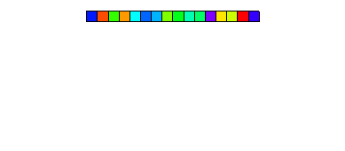

**Property Based Testing**

Property-based testing is a software testing technique where you define general "properties" or invariants that your code should always satisfy, regardless of the input. A testing framework then automatically generates a wide range of diverse inputs, including edge cases, to check if these properties hold true for all of them.

Example 1:

```csharp
using FsCheck.Xunit;
using MergeSort;

namespace PropertyBasedTests.Tests;

public class TestClass()
{
    [Property]
    public bool PropertyOfMyClass_WorksCorrectly(int[] array, int number, string @string)
    {
        // write your checks
    }
}
```

Example 2:

```csharp
using FsCheck.Xunit;
using MergeSort;

namespace PropertyBasedTests.Tests;

public class MergeSortTests()
{

    [Property]
    public bool MergeSortGcFriendly_SortsElementsCorrectly(int[] original)
    {
        var clone = new int[original.Length];
        original.CopyTo(clone, 0);
            
        MergeSortGcFriendly.Sort(clone);
        Array.Sort(original);
            
        return clone.SequenceEqual(original);
    }
}
```


**Scenarios (non exhaustive)**

1. **Testing your code against battle-tested code** 

   For example, you can test your custom implementation of sort algorithm against built in .NET sort, as shown in the example above

2. **Validate code refactoring/improvement against original version**
      
   Merge sort:

     

   Due to "divide and conquer" nature of merge sort - it can be parallelized easilly which will decrease execution time of the algorithm in exchanche to aggressive CPU utilization

   Improved version of the algorithm can be then tested against original version
   
   
3. **Verify that you code satisfies required specification(peroperties)**
   
   Red–black tree is a self-balancing binary search tree data structure noted for fast storage and retrieval of ordered information
   
   In addition to the requirements imposed on a binary search tree the following must be satisfied by a red–black tree:
   
   1. Every node is either red or black.
   2. All null nodes are considered black.
   3. A red node does not have a red child.
   4. Every path from a given node to any of its leaf nodes goes through the same number of black nodes.
   5. (Conclusion) If a node N has exactly one child, the child must be red. If the child were black, its leaves would sit at a different black depth than N's null node (which is considered black by rule 2), violating    requirement 4.

   

   In order to test red-black tree implementation with traditional unit tests ypu will need to cover huga variety of cases. 

   Property-based testing approach on other hand allows to express red-black tree properties in the small amount of code, while testing framework will provide extensive amount of test cases for your implementation

4. **This is just a tool, so you could discover other scenarios where it is reasonable to use it**


**Unit Tests vs Property Based Tests**


|Feature  |Unit Testing  |Property-Based Testing  |
|---------|---------|---------|
|Tests     |Fixed examples         |Randomized values         |
|Focus     |Specific inputs & outputs         |General rules or invariants         |
|Usefulness     |Catch specific errors         |Explore broad input space         |